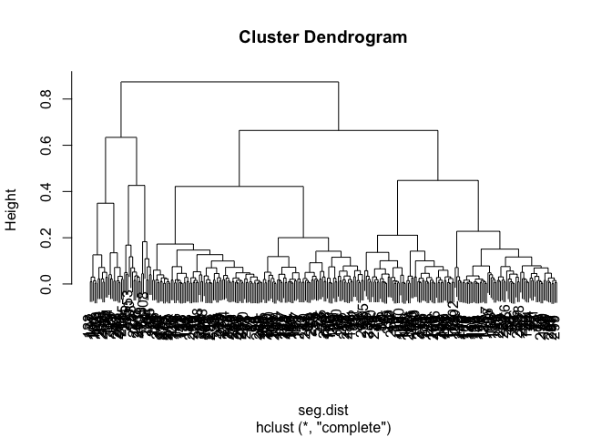
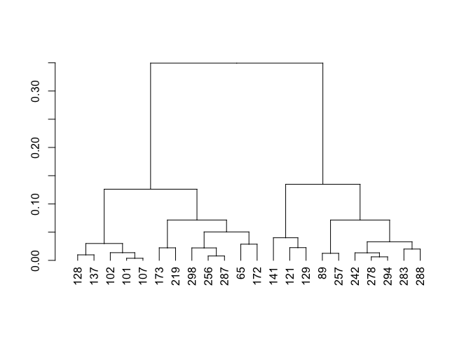
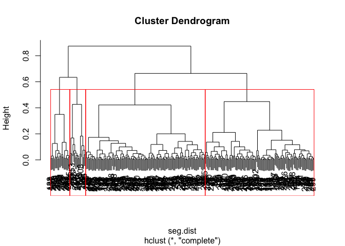
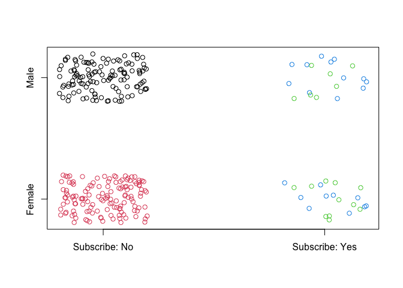
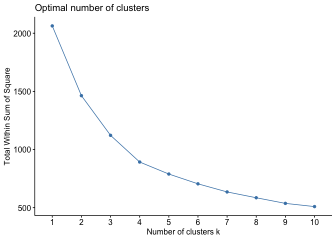
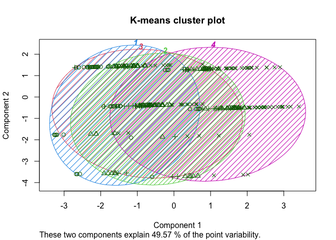
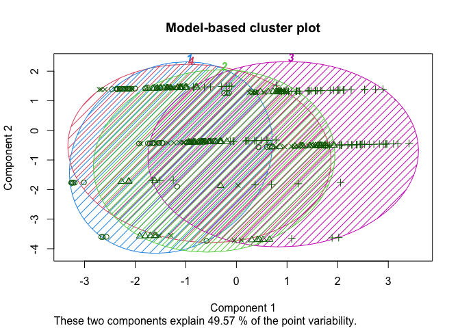
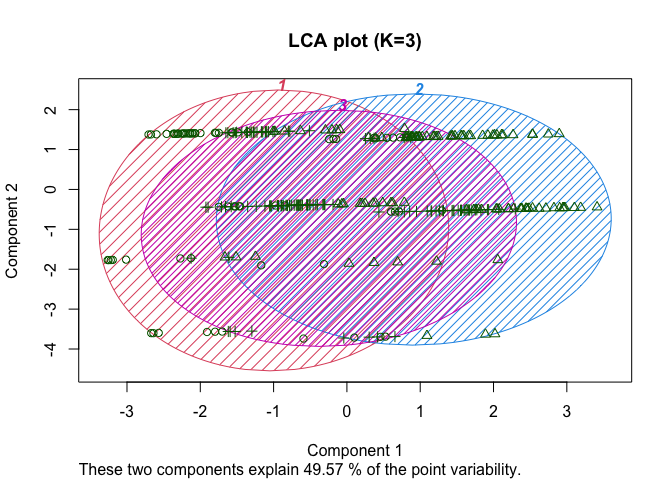
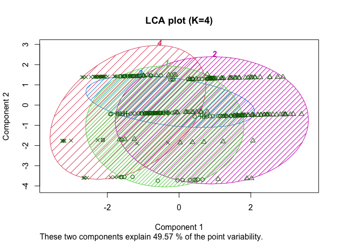

``` r
set.seed(1680)
library(dplyr)
```

    ## 
    ## Attaching package: 'dplyr'

    ## The following objects are masked from 'package:stats':
    ## 
    ##     filter, lag

    ## The following objects are masked from 'package:base':
    ## 
    ##     intersect, setdiff, setequal, union

``` r
library(ISLR)
library(cluster)
library(Rtsne)
library(ggplot2)
library(readxl)
library(reshape)
```

    ## 
    ## Attaching package: 'reshape'

    ## The following object is masked from 'package:dplyr':
    ## 
    ##     rename

``` r
library(factoextra)
```

    ## Welcome! Want to learn more? See two factoextra-related books at https://goo.gl/ve3WBa

``` r
library(cluster)
library(mclust)
```

    ## Package 'mclust' version 6.0.0
    ## Type 'citation("mclust")' for citing this R package in publications.

``` r
##Segmentation Data
rintro.chapter5 <- read.csv("dataset.csv")
#View(rintro.chapter5)
seg.df <- rintro.chapter5[ , -7] # remove the known segment assignments
summary(seg.df)
```

    ##       age           gender              income            kids     
    ##  Min.   :19.26   Length:300         Min.   : -5183   Min.   :0.00  
    ##  1st Qu.:33.01   Class :character   1st Qu.: 39656   1st Qu.:0.00  
    ##  Median :39.49   Mode  :character   Median : 52014   Median :1.00  
    ##  Mean   :41.20                      Mean   : 50937   Mean   :1.27  
    ##  3rd Qu.:47.90                      3rd Qu.: 61403   3rd Qu.:2.00  
    ##  Max.   :80.49                      Max.   :114278   Max.   :7.00  
    ##    ownHome           subscribe          gender_dummy      Sub_dummy     
    ##  Length:300         Length:300         Min.   :0.0000   Min.   :0.0000  
    ##  Class :character   Class :character   1st Qu.:0.0000   1st Qu.:0.0000  
    ##  Mode  :character   Mode  :character   Median :0.0000   Median :0.0000  
    ##                                        Mean   :0.4767   Mean   :0.1333  
    ##                                        3rd Qu.:1.0000   3rd Qu.:0.0000  
    ##                                        Max.   :1.0000   Max.   :1.0000  
    ##    Home_dummy  
    ##  Min.   :0.00  
    ##  1st Qu.:0.00  
    ##  Median :0.00  
    ##  Mean   :0.47  
    ##  3rd Qu.:1.00  
    ##  Max.   :1.00

## Pre-treatment

``` r
#check if all data are input properly if not make changes
sapply(seg.df, class)
```

    ##          age       gender       income         kids      ownHome    subscribe 
    ##    "numeric"  "character"    "numeric"    "integer"  "character"  "character" 
    ## gender_dummy    Sub_dummy   Home_dummy 
    ##    "integer"    "integer"    "integer"

``` r
## standardize data
seg.df[,c("income","age")] <-scale(seg.df[,c("income","age")])

# get rid of NA rows
seg.df <- na.omit(seg.df)
```

## Hierarchical Clustering: hclust() Basics

### Init

``` r
#calculate distance matrix and then look at a matrix for just the first 5 observations as follows:
d <- dist(seg.df[, c("age", "income", "kids")])
as.matrix(d)[1:5, 1:5]
```

    ##          1        2        3        4        5
    ## 1 0.000000 1.746518 2.043167 2.018719 1.857643
    ## 2 1.746518 0.000000 1.430948 2.306941 3.049448
    ## 3 2.043167 1.430948 0.000000 2.137075 3.476185
    ## 4 2.018719 2.306941 2.137075 0.000000 2.022120
    ## 5 1.857643 3.049448 3.476185 2.022120 0.000000

### Problem :we cannot assume that factor variables are irrelevant to our cluster definitions it is better to use all the data

The daisy() function in the cluster. The package works with mixed data
types by rescaling the values, so we use that instead of Euclidean
distance:

``` r
seg.df$gender <- as.factor(seg.df$gender)
seg.df$ownHome<-as.factor(seg.df$ownHome)
seg.df$subscribe<-as.factor(seg.df$subscribe)
seg.dist <- daisy(seg.df)
```

    ## Warning in daisy(seg.df): binary variable(s) 7, 8, 9 treated as interval scaled

``` r
#Selecting the first few rows and columns: 
as.matrix(seg.dist)[1:5, 1:5]
```

    ##           1          2          3         4         5
    ## 1 0.0000000 0.27996547 0.26637963 0.2855945 0.4996448
    ## 2 0.2799655 0.00000000 0.04533187 0.4975218 0.3120757
    ## 3 0.2663796 0.04533187 0.00000000 0.5052897 0.3066416
    ## 4 0.2855945 0.49752177 0.50528969 0.0000000 0.2621402
    ## 5 0.4996448 0.31207568 0.30664158 0.2621402 0.0000000

``` r
seg.hc <- hclust(seg.dist , method="complete")
```

### Plot the dendogram

``` r
plot(seg.hc)
```

<!-- -->

### Dendogram: zoom in on one section of the chart

``` r
plot(cut(as.dendrogram(seg.hc), h=0.5)$lower[[1]])
```

<!-- -->

### Goodness of fit :

``` r
cor(cophenetic(seg.hc), seg.dist)
```

    ## [1] 0.804571

``` r
#In this case, CPCC > 0.7 indicates a relatively strong, meaning that the hierarchical tree represents the distances between customers well
```

``` r
# from the shape of the dendogram, we could try to seperate with 4 clusters
plot(seg.hc)
rect.hclust(seg.hc, k=4, border="red")
```

<!-- -->

``` r
seg.hc.segment <- cutree(seg.hc, k=4) # membership vector for 4 groups
table(seg.hc.segment)
```

    ## seg.hc.segment
    ##   1   2   3   4 
    ## 124 136  18  22

### A function that reports the mean by group

``` r
seg.summ <- function(data , groups) {
  aggregate(data , list(groups), function(x) mean(as.numeric(x)))
}
seg.summ(seg.df, seg.hc.segment)
```

    ##   Group.1         age   gender      income     kids  ownHome subscribe
    ## 1       1 -0.03266548 2.000000 -0.07361676 1.314516 1.467742         1
    ## 2       2  0.06573106 1.000000  0.14019026 1.235294 1.477941         1
    ## 3       3  0.24491893 1.388889  0.08401620 1.388889 2.000000         2
    ## 4       4 -0.42261118 1.545455 -0.52044043 1.136364 1.000000         2
    ##   gender_dummy Sub_dummy Home_dummy
    ## 1    1.0000000         0  0.4677419
    ## 2    0.0000000         0  0.4779412
    ## 3    0.3888889         1  1.0000000
    ## 4    0.5454545         1  0.0000000

### Plot segments

``` r
plot(jitter(as.numeric(seg.df$gender)) ~
       jitter(as.numeric(seg.df$subscribe)),
     col=seg.hc.segment , yaxt="n", xaxt="n", ylab="", xlab="")
axis(1, at=c(1, 2), labels=c("Subscribe: No", "Subscribe: Yes"))
axis(2, at=c(1, 2), labels=levels(seg.df$gender))
```

<!-- -->

``` r
#non-subscribers are broken into two segments (colored red and black) that are perfectly correlated with gender.
```

### Elbow method for the number of clusters

``` r
fviz_nbclust(seg.df, FUN = hcut, method = "wss")
```

    ## Warning in stats::dist(x): NAs introduced by coercion

    ## Warning in stats::dist(x, method = method, ...): NAs introduced by coercion

    ## Warning in stats::dist(x, method = method, ...): NAs introduced by coercion

    ## Warning in stats::dist(x, method = method, ...): NAs introduced by coercion

    ## Warning in stats::dist(x, method = method, ...): NAs introduced by coercion

    ## Warning in stats::dist(x, method = method, ...): NAs introduced by coercion

    ## Warning in stats::dist(x, method = method, ...): NAs introduced by coercion

    ## Warning in stats::dist(x, method = method, ...): NAs introduced by coercion

    ## Warning in stats::dist(x, method = method, ...): NAs introduced by coercion

    ## Warning in stats::dist(x, method = method, ...): NAs introduced by coercion

    ## Warning in stats::dist(x, method = method, ...): NAs introduced by coercion

<!-- -->

``` r
# Using the elbow method, 4 clusters is indeed the most appropriate number of clusters
```

## K-means method

### Init

``` r
#Our first step is to create a variant of seg.df that is recoded to numeric.
seg.df.num <- seg.df
seg.df.num$gender <- ifelse(seg.df$gender=="Male", 0, 1)
seg.df.num$ownHome <- ifelse(seg.df$ownHome=="ownNo", 0, 1)
seg.df.num$subscribe <- ifelse(seg.df$subscribe=="subNo", 0, 1)
summary(seg.df.num)
```

    ##       age              gender           income              kids     
    ##  Min.   :-1.7265   Min.   :0.0000   Min.   :-2.78683   Min.   :0.00  
    ##  1st Qu.:-0.6443   1st Qu.:0.0000   1st Qu.:-0.56016   1st Qu.:0.00  
    ##  Median :-0.1347   Median :1.0000   Median : 0.05352   Median :1.00  
    ##  Mean   : 0.0000   Mean   :0.5233   Mean   : 0.00000   Mean   :1.27  
    ##  3rd Qu.: 0.5269   3rd Qu.:1.0000   3rd Qu.: 0.51976   3rd Qu.:2.00  
    ##  Max.   : 3.0916   Max.   :1.0000   Max.   : 3.14545   Max.   :7.00  
    ##     ownHome       subscribe       gender_dummy      Sub_dummy     
    ##  Min.   :0.00   Min.   :0.0000   Min.   :0.0000   Min.   :0.0000  
    ##  1st Qu.:0.00   1st Qu.:0.0000   1st Qu.:0.0000   1st Qu.:0.0000  
    ##  Median :0.00   Median :0.0000   Median :0.0000   Median :0.0000  
    ##  Mean   :0.47   Mean   :0.1333   Mean   :0.4767   Mean   :0.1333  
    ##  3rd Qu.:1.00   3rd Qu.:0.0000   3rd Qu.:1.0000   3rd Qu.:0.0000  
    ##  Max.   :1.00   Max.   :1.0000   Max.   :1.0000   Max.   :1.0000  
    ##    Home_dummy  
    ##  Min.   :0.00  
    ##  1st Qu.:0.00  
    ##  Median :0.00  
    ##  Mean   :0.47  
    ##  3rd Qu.:1.00  
    ##  Max.   :1.00

\#\<@@ We ask for four clusters with 4 centers:

``` r
set.seed(96743)
seg.k <- kmeans(seg.df.num, centers=4)
seg.summ(seg.df, seg.k$cluster)
```

    ##   Group.1        age   gender     income       kids  ownHome subscribe
    ## 1       1 -1.2518286 1.622642 -1.4219024 0.90566038 1.226415  1.188679
    ## 2       2 -0.2519837 1.401961  0.1897795 1.25490196 1.362745  1.147059
    ## 3       3 -0.2777982 1.446429  0.1171878 3.62500000 1.446429  1.089286
    ## 4       4  1.2090557 1.494382  0.5555146 0.02247191 1.752809  1.112360
    ##   gender_dummy  Sub_dummy Home_dummy
    ## 1    0.6226415 0.18867925  0.2264151
    ## 2    0.4019608 0.14705882  0.3627451
    ## 3    0.4464286 0.08928571  0.4464286
    ## 4    0.4943820 0.11235955  0.7528090

### Unlike with hclust() we now see some interesting differences: the groups appear to vary by age, gender, kids, income, and home ownership

``` r
clusplot(seg.df, seg.k$cluster , color=TRUE , shade=TRUE ,
           labels=4, lines=0, main="K-means cluster plot")
```

<!-- -->

## Model-Based Clustering: Mclust()

### Init

``` r
#The key idea for model-based clustering is that observations come from groups with different statistical distributions (such as different means and variances). The algorithms try to find the best set of such underlying distributions to explain theobserved data.because mclust models data with normal distributions, it uses only numeric data.

library(mclust)
seg.mc <- Mclust(seg.df.num)
summary(seg.mc)
```

    ## ---------------------------------------------------- 
    ## Gaussian finite mixture model fitted by EM algorithm 
    ## ---------------------------------------------------- 
    ## 
    ## Mclust XXX (ellipsoidal multivariate normal) model with 1 component: 
    ## 
    ##  log-likelihood   n df      BIC      ICL
    ##        28488.49 300 54 56668.97 56668.97
    ## 
    ## Clustering table:
    ##   1 
    ## 300

``` r
seg.summ(seg.df, seg.mc$class)
```

    ##   Group.1          age   gender       income kids ownHome subscribe
    ## 1       1 3.561062e-17 1.476667 -7.84704e-17 1.27    1.47  1.133333
    ##   gender_dummy Sub_dummy Home_dummy
    ## 1    0.4766667 0.1333333       0.47

``` r
# 4 clusters
seg.mc4 <- Mclust(seg.df.num, G=4) 
summary(seg.mc4)
```

    ## ---------------------------------------------------- 
    ## Gaussian finite mixture model fitted by EM algorithm 
    ## ---------------------------------------------------- 
    ## 
    ## Mclust VII (spherical, varying volume) model with 4 components: 
    ## 
    ##  log-likelihood   n df       BIC       ICL
    ##       -2410.182 300 43 -5065.628 -5093.027
    ## 
    ## Clustering table:
    ##   1   2   3   4 
    ##  50 102  90  58

### Cluster plot

``` r
clusplot(seg.df, seg.mc4$class , color=TRUE , shade=TRUE ,
             labels=4, lines=0, main="Model-based cluster plot")
```

<!-- -->

### Comparing Models with BIC()

``` r
#Note the lower the value of BIC, on an infinite number line,the better. 
BIC(seg.mc , seg.mc4)
```

    ##         df        BIC
    ## seg.mc  54 -56668.971
    ## seg.mc4 43   5065.628

\##Latent class analysis (LCA)

``` r
#Latent class analysis (LCA) is similar to mixture modeling in the assumption that differences are attributable to unobserved groups that one wishes to uncover.
#convert our data seg.df to be all categorical data before analyzing it
#make everything as binary with regards to a specified cutting point(for instance, to recode as 1 for income below some cutoff and 2 above that
#we split each variable at the median() and recode using ifelse() and factor()
seg.df.cut <- seg.df
seg.df.cut$age <- factor(ifelse(seg.df$age < median(seg.df$age), 1, 2))
seg.df.cut$income <- factor(ifelse(seg.df$income < median(seg.df$income), 1, 2))
seg.df.cut$kids <- factor(ifelse(seg.df$kids < median(seg.df$kids), 1, 2))
summary(seg.df.cut)
```

    ##  age        gender    income  kids      ownHome     subscribe  
    ##  1:150   Female:157   1:150   1:121   ownNo :159   subNo :260  
    ##  2:150   Male  :143   2:150   2:179   ownYes:141   subYes: 40  
    ##                                                                
    ##                                                                
    ##                                                                
    ##                                                                
    ##   gender_dummy      Sub_dummy        Home_dummy  
    ##  Min.   :0.0000   Min.   :0.0000   Min.   :0.00  
    ##  1st Qu.:0.0000   1st Qu.:0.0000   1st Qu.:0.00  
    ##  Median :0.0000   Median :0.0000   Median :0.00  
    ##  Mean   :0.4767   Mean   :0.1333   Mean   :0.47  
    ##  3rd Qu.:1.0000   3rd Qu.:0.0000   3rd Qu.:1.00  
    ##  Max.   :1.0000   Max.   :1.0000   Max.   :1.00

### fit poLCA models

``` r
seg.f <- with(seg.df.cut , cbind(age , gender , income , kids , ownHome , subscribe)~1)
library(poLCA)
```

    ## Loading required package: scatterplot3d

    ## Loading required package: MASS

    ## 
    ## Attaching package: 'MASS'

    ## The following object is masked from 'package:dplyr':
    ## 
    ##     select

``` r
set.seed (02807)
#we fit poLCA models for K=3 and K=4 clusters using poLCA(formula,data, nclass=K)
seg.LCA3 <- poLCA(seg.f, data=seg.df.cut , nclass =3)
```

    ## Conditional item response (column) probabilities,
    ##  by outcome variable, for each class (row) 
    ##  
    ## $age
    ##                1      2
    ## class 1:  1.0000 0.0000
    ## class 2:  0.0000 1.0000
    ## class 3:  0.6555 0.3445
    ## 
    ## $gender
    ##           Female   Male
    ## class 1:  0.4211 0.5789
    ## class 2:  0.4681 0.5319
    ## class 3:  0.6079 0.3921
    ## 
    ## $income
    ##                1      2
    ## class 1:  1.0000 0.0000
    ## class 2:  0.3803 0.6197
    ## class 3:  0.3746 0.6254
    ## 
    ## $kids
    ##                1      2
    ## class 1:  0.2818 0.7182
    ## class 2:  0.8065 0.1935
    ## class 3:  0.1575 0.8425
    ## 
    ## $ownHome
    ##            ownNo ownYes
    ## class 1:  0.7289 0.2711
    ## class 2:  0.2338 0.7662
    ## class 3:  0.6638 0.3362
    ## 
    ## $subscribe
    ##            subNo subYes
    ## class 1:  0.7496 0.2504
    ## class 2:  0.8948 0.1052
    ## class 3:  0.8960 0.1040
    ## 
    ## Estimated class population shares 
    ##  0.1974 0.341 0.4616 
    ##  
    ## Predicted class memberships (by modal posterior prob.) 
    ##  0.2333 0.3467 0.42 
    ##  
    ## ========================================================= 
    ## Fit for 3 latent classes: 
    ## ========================================================= 
    ## number of observations: 300 
    ## number of estimated parameters: 20 
    ## residual degrees of freedom: 43 
    ## maximum log-likelihood: -1092.345 
    ##  
    ## AIC(3): 2224.691
    ## BIC(3): 2298.767
    ## G^2(3): 42.77441 (Likelihood ratio/deviance statistic) 
    ## X^2(3): 38.47647 (Chi-square goodness of fit) 
    ## 

``` r
seg.LCA4 <- poLCA(seg.f, data=seg.df.cut , nclass =4)
```

    ## Conditional item response (column) probabilities,
    ##  by outcome variable, for each class (row) 
    ##  
    ## $age
    ##                1      2
    ## class 1:  0.6823 0.3177
    ## class 2:  0.0000 1.0000
    ## class 3:  1.0000 0.0000
    ## class 4:  1.0000 0.0000
    ## 
    ## $gender
    ##           Female   Male
    ## class 1:  0.5853 0.4147
    ## class 2:  0.4810 0.5190
    ## class 3:  0.8466 0.1534
    ## class 4:  0.3277 0.6723
    ## 
    ## $income
    ##                1      2
    ## class 1:  0.4137 0.5863
    ## class 2:  0.3701 0.6299
    ## class 3:  0.5850 0.4150
    ## class 4:  1.0000 0.0000
    ## 
    ## $kids
    ##                1      2
    ## class 1:  0.0000 1.0000
    ## class 2:  0.8114 0.1886
    ## class 3:  1.0000 0.0000
    ## class 4:  0.2506 0.7494
    ## 
    ## $ownHome
    ##            ownNo ownYes
    ## class 1:  0.6540 0.3460
    ## class 2:  0.2688 0.7312
    ## class 3:  0.6537 0.3463
    ## class 4:  0.7721 0.2279
    ## 
    ## $subscribe
    ##            subNo subYes
    ## class 1:  0.8746 0.1254
    ## class 2:  0.8965 0.1035
    ## class 3:  1.0000 0.0000
    ## class 4:  0.7203 0.2797
    ## 
    ## Estimated class population shares 
    ##  0.4101 0.3697 0.0643 0.1559 
    ##  
    ## Predicted class memberships (by modal posterior prob.) 
    ##  0.41 0.3733 0.0667 0.15 
    ##  
    ## ========================================================= 
    ## Fit for 4 latent classes: 
    ## ========================================================= 
    ## number of observations: 300 
    ## number of estimated parameters: 27 
    ## residual degrees of freedom: 36 
    ## maximum log-likelihood: -1088.021 
    ##  
    ## AIC(4): 2230.041
    ## BIC(4): 2330.043
    ## G^2(4): 34.12473 (Likelihood ratio/deviance statistic) 
    ## X^2(4): 31.50696 (Chi-square goodness of fit) 
    ## 

### Comparing the two models

``` r
seg.LCA4$bic
```

    ## [1] 2330.043

``` r
seg.LCA3$bic
```

    ## [1] 2298.767

### As we’ve seen that is not entirely conclusive as to business utility so we also examine some other indicators such as the quick summary functionand cluster plots

``` r
seg.summ(seg.df , seg.LCA3$predclass)
```

    ##   Group.1        age   gender     income      kids  ownHome subscribe
    ## 1       1 -1.0211194 1.685714 -1.0359362 1.1285714 1.285714  1.271429
    ## 2       2  1.0422585 1.576923  0.4541730 0.3846154 1.769231  1.105769
    ## 3       3 -0.2929883 1.277778  0.2006472 2.0793651 1.325397  1.079365
    ##   gender_dummy  Sub_dummy Home_dummy
    ## 1    0.6857143 0.27142857  0.2857143
    ## 2    0.5769231 0.10576923  0.7692308
    ## 3    0.2777778 0.07936508  0.3253968

### Plot for K=3

``` r
clusplot(seg.df , seg.LCA3$predclass , color=TRUE , shade=TRUE ,
         labels=4, lines=0, main="LCA plot (K=3)")
```

<!-- -->

### Plot for K=4

``` r
clusplot(seg.df , seg.LCA4$predclass , color=TRUE , shade=TRUE ,
         labels=4, lines=0, main="LCA plot (K=4)")
```

<!-- -->

``` r
seg.summ(seg.df , seg.LCA4$predclass)
```

    ##   Group.1        age   gender      income      kids  ownHome subscribe
    ## 1       1 -0.3599560 1.349593  0.05678915 2.1951220 1.349593  1.113821
    ## 2       2  0.9790400 1.535714  0.47660399 0.5178571 1.785714  1.098214
    ## 3       3 -0.8635819 1.050000 -0.47546639 0.0000000 1.350000  1.000000
    ## 4       4 -1.0690280 1.866667 -1.13011964 1.1777778 1.066667  1.333333
    ##   gender_dummy  Sub_dummy Home_dummy
    ## 1    0.3495935 0.11382114 0.34959350
    ## 2    0.5357143 0.09821429 0.78571429
    ## 3    0.0500000 0.00000000 0.35000000
    ## 4    0.8666667 0.33333333 0.06666667

### We use table() to look at the cross-tabs between the LCA 3-cluster and 4-cluster solutions found above

``` r
table(seg.LCA3$predclass , seg.LCA4$predclass)
```

    ##    
    ##       1   2   3   4
    ##   1  13   0  12  45
    ##   2   0 104   0   0
    ##   3 110   8   8   0
