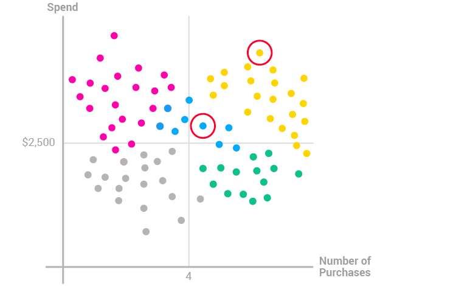

## Consumer Analytics : Clustering methods for consumer segmentation

## L'objectif de ce projet est d'explorer plusieurs méthodes de clusterisation dans un contexte Marketing : 
- On souhaite segmenter un échantillon de consommateurs en groupes ayant des similarités.
- A travers ce projet j'ai appris : 
    - Approfondissement de mes connaissances en terme d'apprentissage non supervisé, et en particuliers les différentes méthodes populaires de clustering ( kmean LCA, hist)????
    - Application de cet apprentissage non supervce face a un business case très precis : la segmentation des consommateurs
    - Prise en main du langage R.

Dans ce projet nous dispons des données de XX consommateur 
- sex 
-nombre d'enfant 
- pissede une maison 
- salaire

le but des de trouver de segmenter ce dataset en groupes de consommateurs similaires en utilisaatn des méthodes de clusterings
voici les méthodes de clusterings qui seront utlisés : 

hc ? 

K mean 

LCA

L'ensemble des résulats et retrouvable sur le Notbook.md

