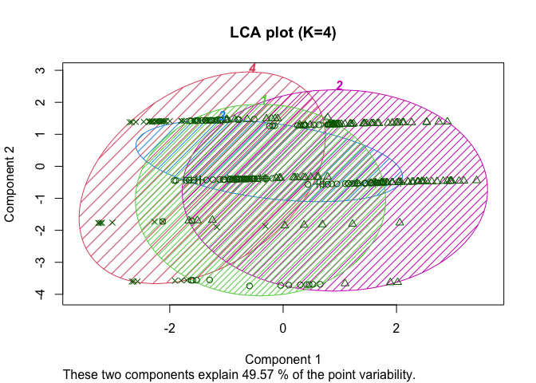
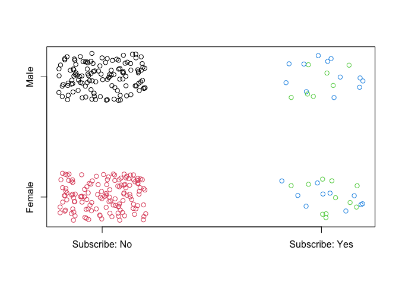
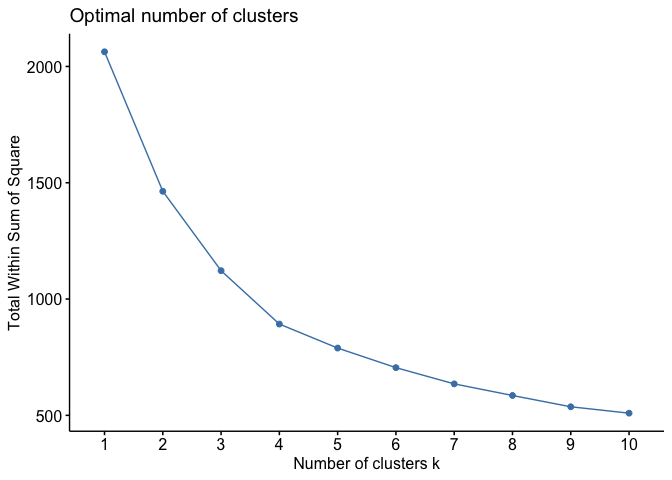

# Consumer Analytics : Clustering methods for consumer segmentation

- **Note: The entire project code is available in the file [Notebook.md](Notebook.md)**.
## Table of Content:
1. [Purpose of the project](#1)
2. [Dataset](#2)
3. [Methods used](#3)
    1. [Hierarchical Clustering](#3-1)
    2. [K-means](#3-2)
    3. [Latent Class Analysis (LCA)](#3-3)
4. [Analysis](#4)

## Purpose of the project 

 - The objective of this project is to explore several clustering methods in a marketing context: we want to segment a sample of consumers into groups with similarities.
- Through this project I learned : 
    - Deepening my knowledge of unsupervised learning, and in particular the various popular clustering methods (K-means, Hierarchical Clustering, Model-based Clustering)
    - Application of this unsupervised learning to a very specific business case: **consumer segmentation**
    - Getting started with the R language
## Dataset 
In this project we have collected data from 114 consumers. Here is a table showing all the information available for each of these consumers:

|Variable|Data Type|Comment|
|--------------|------------|------------|
|Age|Float|Age of the person|
|gender|Boolean|Male (1) or Female (0)|
|income|Float|Yearly income of the person|
|Kids|Integer|Number of kids of the person (if any)|
|OwnHome|Boolean|If the person owns a Home (1) or not (0)|
|Subscribe|Boolean|If the person subscribed to a given service|
|Segment|String|Consumer segment to which the person belongs (removed and replaced by the clustering task)|

## Methods used 
During this project I explored, evaluated and compared 3 different clustering methods. Here is a short description for each of them:
### Hierarchical Clustering 

- Hierarchical clustering starts by treating each observation as a separate cluster. Then, it repeatedly executes the following two steps: (1) identify the two clusters that are closest together, and (2) merge the two most similar clusters. This iterative process continues until all the clusters are merged together. The main output of Hierarchical Clustering is a **dendrogram**, which shows the hierarchical relationship between the clusters.

- *Dendogram obtained by applying the hierachical clustering method on our consumer dataset. Our selection of 4 clusters is outlined in red.*

### K-means 

- the K-means algorithm  starts with a first group of randomly selected centroids, which are used as the beginning points for every cluster, and then performs iterative (repetitive) calculations to optimize the positions of the centroids.It halts creating and optimizing clusters when either:
    - The centroids have stabilized — there is no change in their values because the clustering has been successful.
    - The defined number of iterations has been achieved.
- **K-means is non-deterministic :** When applying the K-means algorithm, it is first necessary to determine an initial partition based on the initial clustering centre and then to optimise the initial partition. The selection of this initial clustering centre has a greater impact on the clustering results. If the initial value is not well selected, efficient clustering results may not be obtained

- *Gif showing the operation and convergence of the K-means method with 3 clusters.*

### Latent Class Analysis (LCA) 

- LCA is a technique where constructs are identified and created from unobserved, or latent, subgroups, which are usually based on individual responses from multivariate categorical data. These constructs are then used for r further analysis. LCA models can also be referred to as finite mixture models

- *Clusters obtained by applying the LCAmethod on our consumer dataset.*

### Analysis 
Here are some elements of analysis that I find relevant to put in this report:
- **Goodness of fit** : by calculating the the cophenetic distances for the Hierarchical Clustering:

        cor(cophenetic(seg.hc), seg.dist)
         [1] 0.804571
- CPCC=0.80 and is > 0.7 indicates a relatively strong, meaning that the hierarchical tree represents the distances between customers well
- **Plot segments**:

- *non-subscribers are broken into two segments (colored red and black) that are perfectly correlated with gender.*

- **Number of clusters**:

- *Using the elbow method, 4 clusters is indeed the most appropriate number of clusters*

- **Comparing LCA with 4 clusters with LCA with 3 clusters with BIC method**:

        seg.LCA4$bic
        [1] 2330.043
        seg.LCA3$bic
        [1] 2298.767
- *Both models have the same BIC,it is hard to tell which one is better with this criterion*

- As we’ve seen that is not entirely conclusive as to business utility so we also examine some other indicators such as the quick summary function and cluster plots, available in the [Notebook.md](Notebook.md) file.

